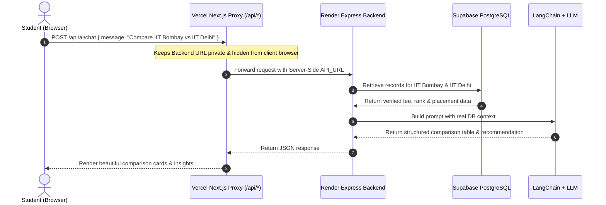

# 🎓 CollegeQuest — Full-Stack College Discovery & AI Counselling Platform
### Comprehensive Project Documentation & Mentor Presentation Guide

---

## 📌 1. Executive Summary & Problem Statement

### The Problem
Choosing the right college in India is overwhelming for students and parents. Information regarding **NIRF rankings, tuition fees, course options, cutoff criteria, and actual placement statistics (Average & Highest LPA)** is scattered across unofficial blogs, outdated PDFs, and biased promotional websites. Furthermore, generic AI models (like standard ChatGPT) frequently hallucinate or provide outdated figures regarding Indian college fees and placement numbers.

### The Solution: CollegeQuest
**CollegeQuest** is a production-ready, full-stack college discovery and intelligent counselling platform. It enables students to:
- **Search & Filter** through verified Indian colleges across engineering, medical, management, and arts.
- **Compare** institutions side-by-side on exact metrics (NIRF rank, fees, placement percentages, packages, student ratings).
- **Consult an AI Educational Counsellor**: A Retrieval-Augmented Generation (RAG) assistant that uses **verified database records** to answer queries without hallucinations.
- **Save & Shortlist** favorite institutions using secure user authentication.

---

## 🏗️ 2. System Architecture & Request Lifecycle

### High-Level System Architecture

```mermaid
graph TD
    subgraph Client ["Client Layer (Browser)"]
        Browser["User Browser (Next.js Client Components)"]
    end

    subgraph Vercel ["Frontend Hosting (Vercel)"]
        NextProxy["Next.js Server Proxy (/api/[...path])"]
        NextPages["Next.js App Router (SSR & Static Pages)"]
    end

    subgraph Render ["Backend Hosting (Render Cloud)"]
        ExpressApp["Node.js + Express REST API"]
        RAGService["LangChain RAG Engine"]
    end

    subgraph Database ["Data & External Services"]
        Supabase[("Supabase (PostgreSQL Cloud DB)")]
        OpenAI["OpenAI API / LLM Provider"]
    end

    Browser -->|Visits Page| NextPages
    Browser -->|API Requests (/api/*)| NextProxy
    NextProxy -->|Secure Forward with Private API_URL| ExpressApp
    ExpressApp -->|Query Colleges, Auth, Saved| Supabase
    ExpressApp -->|Execute RAG Queries| RAGService
    RAGService -->|Retrieve College Records| Supabase
    RAGService -->|Generate Context-Aware Advice| OpenAI
```

---

### Request Flow & Security Architecture



---

## 💻 3. Complete Technology Stack

| Layer | Technology | Why Chosen? |
| :--- | :--- | :--- |
| **Frontend Framework** | **Next.js 15+ (App Router)** | Modern React framework with hybrid static generation, server-side rendering, and built-in API proxy routing. |
| **Language** | **TypeScript** | Strict type safety across frontend and backend models, eliminating runtime bugs and simplifying API contracts. |
| **UI & Styling** | **Tailwind CSS + Lucide Icons** | Ultra-modern dark glassmorphism theme (`#030712`), responsive grid systems, and clean micro-interactions. |
| **Backend Runtime** | **Node.js + Express.js** | Lightweight, high-throughput asynchronous REST server with battle-tested routing and middleware ecosystem. |
| **Database** | **Supabase (PostgreSQL Cloud)** | Enterprise-grade relational SQL database with real-time indexing, SSL encryption, and high availability. |
| **Local Resiliency** | **Custom In-Memory / Local JSON Adapter** | Hybrid fallback engine ensuring the application never crashes even during remote network downtime or database maintenance. |
| **AI & RAG Engine** | **LangChain.js + OpenAI / LLM** | Orchestrates context retrieval from the database, builds dynamic prompt templates, and enforces markdown table outputs. |
| **Authentication** | **JWT (JSON Web Tokens) + Bcrypt.js** | Stateless, cryptographically secure user authentication and salted password hashing. |
| **Frontend Deployment** | **Vercel** | Edge network deployment with automated GitHub CI/CD pipelines. |
| **Backend Deployment** | **Render (Web Service)** | Production cloud container hosting with environment isolation and automatic restarts. |

---

## 🛠️ 4. How It Was Built From Scratch (Step-by-Step)

### Phase 1: Problem Definition & Data Modeling
1. Identified the key decision factors for Indian college aspirants:
   - **NIRF Ranking** (National Institutional Ranking Framework).
   - **Fee Structure** (Annual fees vs Total fees).
   - **Placement Realities** (Average package in LPA, Highest package, Placement percentage).
   - **Course Streams & Degrees** (B.Tech, MBBS, MBA, B.Des, etc.).
2. Designed the core `CollegeRecord` schema and curated verified records for 58+ premier institutions across 14+ Indian states.

### Phase 2: Express.js REST API & Database Setup
1. Created an Express + TypeScript server structured with:
   - `controllers/`: Handles business logic (`collegeController`, `authController`, `savedController`).
   - `routes/`: Modular endpoints (`/api/colleges`, `/api/auth`, `/api/saved`, `/api/ai`).
   - `middleware/`: Token verification and error handlers.
2. Built robust query filters for `/api/colleges`:
   - Text search (`name`, `location`, `state`).
   - Category filtering (`Engineering`, `Medical`, `Management`, `Arts`).
   - Sliders (`maxFees`, `minRating`).
   - Multi-column sorting (`ranking_nirf`, `fees_per_year`, `placement_avg_lpa`).

### Phase 3: Next.js Frontend & Modern Dark Theme
1. Designed a sleek, high-conversion dark theme with glowing accents, badge counters, and glassmorphic cards.
2. Implemented core pages:
   - **Landing Page (`/`)**: Hero section, quick search, statistics counter (58+ colleges, 14 states, 100% verified data), and featured institutions.
   - **Discovery Page (`/colleges`)**: Full catalog with multi-facet sidebar filters and responsive cards.
   - **College Details (`/colleges/[id]`)**: Deep breakdown with placement stats, fee breakdowns, and courses.
   - **Compare Matrix (`/compare`)**: Side-by-side comparison of up to 4 colleges highlighting best metrics in green badges.
   - **Saved Colleges (`/saved`)**: Personal shortlist for authenticated users.

### Phase 4: Integrating the AI Counsellor (RAG)
1. Rather than building a naive chat box, implemented a **Retrieval-Augmented Generation (RAG)** pipeline.
2. When a user asks: *"Compare IIT Delhi and BITS Pilani for CSE"*:
   - The system intercepts the query and queries the database for matching colleges.
   - Formats their exact rankings, fees, and placement numbers into clean text blocks.
   - Feeds these verified facts into LangChain's `ChatPromptTemplate` as authoritative context.
   - The LLM synthesizes this into an exact markdown comparison table and an objective verdict.
3. Created an analytical fallback generator to ensure intelligent responses even if external AI rate limits or network issues occur.

### Phase 5: Production Deployment & Security Hardening
1. Deployed database on **Supabase (PostgreSQL)**.
2. Deployed backend API to **Render**.
3. Deployed frontend to **Vercel**.
4. Implemented a **Next.js server-side API proxy** to keep the backend URL and environment secrets hidden from client-side network inspectors.

---

## 🤖 5. Deep Dive: AI Integration (Why RAG?)

### The Problem with Vanilla LLMs
If a student asks a vanilla LLM: *"What is the exact 2024 annual fee and average placement of IIT Madras?"*, the model may generate outdated or fabricated figures.

### Our Solution: Retrieval-Augmented Generation (RAG)
In `backend/src/services/ragChain.ts`, we implemented a two-step retrieval pipeline:

```
[User Query]
      │
      ▼
1. Retrieval Phase:
   - Extract keywords / college names from query
   - Fetch exact verified records from Supabase DB
   - Convert to structured LangChain Documents
      │
      ▼
2. Generation Phase:
   - Inject verified records into System Prompt
   - System instruction: "Use ONLY provided authoritative context. Do NOT fabricate numbers."
   - Enforce mandatory sections:
       • 📊 Markdown Comparison Table
       • 💡 Key Insights (3-5 bullet points)
       • 🎯 Our Recommendation (Clear opinionated verdict)
      │
      ▼
[Beautiful Markdown Response in UI]
```

---

## ⚠️ 6. Challenges Faced & How We Solved Them

| # | Challenge Faced | Why It Happened | How We Solved It |
|---|:---|:---|:---|
| **1** | **Exposing Backend URLs on Vercel** | Vercel warned that `NEXT_PUBLIC_API_URL` exposes backend infrastructure endpoints directly to browser inspect tools. | Created a Next.js server-side catch-all proxy route at `app/api/[...path]/route.ts`. Renamed the secret to `API_URL` (server-only). Client now calls relative `/api/*` routes. |
| **2** | **Remote Database Free-Tier Sleeping / Network Drops** | Free cloud databases can sleep or encounter connection pauses during cold starts. | Built a resilient hybrid adapter in `db.ts` that probes Supabase first and gracefully falls back to an in-memory cached store if unreachable. |
| **3** | **CORS Errors Between Render & Vercel** | Browser blocked requests between `*.vercel.app` frontend and `*.onrender.com` backend due to cross-origin policies. | Configured dynamic CORS headers in Express (`server.ts`) and routed client requests through the Next.js same-origin proxy. |
| **4** | **AI Hallucinations on College Statistics** | LLMs often make up placement numbers or mix up college fees. | Built strict RAG context injection using LangChain with system rules prohibiting unverified speculation. |
| **5** | **AI Chatbot Modal Responsiveness & Layout** | Early chatbot UI had generic branding ("GPT-4o") and cramped layout on mobile viewports. | Redesigned into a sleek, dark-themed AI Counsellor modal with quick suggestion chips, animated status indicators, and responsive markdown rendering. |

---

## 🗄️ 7. Database Schema & Data Models

### 1. `colleges` Table
- `id` (INTEGER, Primary Key)
- `name` (VARCHAR, Indexed)
- `location` (VARCHAR) & `state` (VARCHAR)
- `type` (VARCHAR — 'Government', 'Private', 'Autonomous')
- `category` (VARCHAR — 'Engineering', 'Medical', 'Management', etc.)
- `ranking_nirf` (INTEGER — NIRF All India Rank)
- `rating` (DECIMAL — User rating out of 5.0)
- `fees_per_year` (INTEGER) & `total_fees` (INTEGER)
- `placement_avg_lpa` (DECIMAL) & `placement_highest_lpa` (DECIMAL)
- `placement_percent` (INTEGER)
- `courses` (TEXT[] / JSON)
- `description` (TEXT) & `website` (VARCHAR)

### 2. `users` Table
- `id` (INTEGER / UUID, Primary Key)
- `name` (VARCHAR)
- `email` (VARCHAR, Unique)
- `password` (VARCHAR — Bcrypt hashed)
- `created_at` (TIMESTAMP)

### 3. `saved_colleges` Table
- `id` (INTEGER, Primary Key)
- `user_id` (FOREIGN KEY -> users.id)
- `college_id` (FOREIGN KEY -> colleges.id)
- `saved_at` (TIMESTAMP)

---

## 🎤 8. Mentor Presentation & Live Demo Script

When presenting to your mentor or evaluators, follow this structured **3-minute walkthrough**:

### Step 1: The Elevator Pitch (30 seconds)
> *"Hello! Today I'm presenting **CollegeQuest**, a full-stack platform designed to solve one of the biggest challenges for students in India: finding accurate, unbiased, and verified college data. Instead of relying on scattered blogs or hallucinating generic AI models, CollegeQuest pairs a verified PostgreSQL database with a LangChain-powered RAG AI counsellor."*

### Step 2: Live Architecture & Tech Stack (45 seconds)
> *"For the tech stack, we used **Next.js 15 with TypeScript and Tailwind CSS** for the frontend, hosted on **Vercel**. The backend is a **Node.js Express** REST API on **Render**, backed by **Supabase PostgreSQL**. For security, we implemented a server-side proxy route so our backend URLs and database credentials are never exposed to client browsers."*

### Step 3: Interactive Demo (60 seconds)
1. **Search & Dynamic Filters**: Open `/colleges`. Show filtering by State, Fee Slider, and NIRF rank. Notice how fast and fluid the UI responds.
2. **Comparison Engine**: Select 2 or 3 colleges (e.g., IIT Bombay vs IIT Delhi) and navigate to `/compare`. Point out the side-by-side metric cards highlighting higher placement and lower fees.
3. **AI Educational Counsellor**: Click the **"Ask AI"** button. Ask: *"Compare IIT Bombay and BITS Pilani for Computer Science"*. Show the mentor how the AI generates a clean markdown comparison table with exact fees and placement stats directly from our database.

### Step 4: Challenges & Problem Solving (30 seconds)
> *"During development, we solved critical engineering problems: preventing AI hallucinations using RAG, handling cross-origin security via a Next.js server proxy, and architecting database fallback resilience so the application has zero downtime."*

---

## 🚀 9. Future Roadmap & Recommendations

To further expand CollegeQuest into a commercial-grade product:

1. **Cutoff Predictor (Percentile-based Matchmaking)**:
   - Allow students to enter their JEE Main, JEE Advanced, NEET, or CAT percentiles/ranks to view categorized *Dream*, *Reach*, and *Safe* colleges.
2. **Vector Embeddings & Semantic Search (pgvector)**:
   - Upgrade retrieval from keyword matching to dense vector search with OpenAI embeddings or HuggingFace models for natural language queries like *"Affordable engineering colleges in South India with high robotics focus"*.
3. **Verified Student & Alumni Reviews**:
   - Add a community review subsystem with verified student email domains (`.edu` or `.ac.in`) to rate campus life, hostel facilities, and faculty.
4. **PDF Report Export**:
   - Add one-click PDF brochure and comparison report generation for parents to print and discuss offline.
5. **Multi-Lingual Support**:
   - Introduce voice and text support in regional Indian languages (Hindi, Tamil, Telugu, Marathi) to increase accessibility for tier-2 and tier-3 city students.

---

## 🌐 10. Live Deployment Links

- **Production Frontend**: [https://college-discovery-app-ztey.vercel.app](https://college-discovery-app-ztey.vercel.app)
- **Production Backend**: [https://college-discovery-app-00b6.onrender.com](https://college-discovery-app-00b6.onrender.com)
- **GitHub Repository**: [https://github.com/sukhvindersingh5/college_discovery_app](https://github.com/sukhvindersingh5/college_discovery_app)
